<div align="center">



<br>


</div>

---

```terminal
┌─[rodrigo@github]─[~/profile]
└──╼ $ cat about_me.txt
```

## 👾 Sobre mí

Soy **Rodrigo Moreno Bielsa**, desarrollador **Full Stack Junior** con formación en **Desarrollo de Aplicaciones Web**, **Sistemas Microinformáticos y Redes** y **Big Data e Inteligencia Artificial**.

Me interesa crear soluciones útiles combinando **desarrollo web**, **bases de datos**, **análisis de datos**, **automatización** e **inteligencia artificial**.  
También tengo experiencia en **soporte técnico**, **documentación**, **resolución de incidencias** y trabajo en entornos profesionales.

```terminal
STATUS: online
MODE: learning
OBJECTIVE: build useful tech with clean design
LOCATION: Spain
```

---

## 🧠 Perfil técnico

<table>
<tr>
<td width="33%" valign="top">

### 🌐 Full Stack Web
- HTML, CSS, JavaScript
- React
- PHP, Java, Node
- SQL, MySQL
- Diseño web visual

</td>
<td width="33%" valign="top">

### 📊 Big Data & IA
- Python
- pandas, NumPy
- scikit-learn
- Jupyter Notebook
- Streamlit, Power BI
- Modelos de clasificación y regresión

</td>
<td width="33%" valign="top">

### 🛠️ Sistemas & Soporte
- Windows / Linux
- Bash, PowerShell
- Redes y usuarios
- Permisos y documentación
- Resolución de incidencias
- Soporte técnico

</td>
</tr>
</table>

---

```terminal
┌─[skills@terminal]─[~/stack]
└──╼ $ ./load_stack.sh
```

<div align="center">

### ⚙️ Lenguajes y herramientas


<br><br>


</div>

---

## 🚀 Proyectos destacados

```terminal
$ ls ./featured_projects
```

### 🚗 Calculadora de emisiones de CO₂
Proyecto de **Machine Learning aplicado a sostenibilidad** para estimar emisiones de CO₂ de vehículos a partir de características técnicas.

**Stack:** Python · pandas · scikit-learn · Streamlit · joblib

---

### 🗄️ Aplicación web con base de datos
Aplicación web con operaciones CRUD, conexión a base de datos y estructura preparada para despliegue en contenedores.

**Stack:** Flask · MySQL · Docker · HTML · CSS · Python

---

### 📊 Análisis de datos e IA
Prácticas y proyectos centrados en limpieza, tratamiento, visualización de datos y entrenamiento de modelos.

**Stack:** Python · pandas · NumPy · scikit-learn · Jupyter Notebook · Power BI

---

## 🎓 Formación

```terminal
$ cat education.log
```

- **Curso de Especialización en Big Data e Inteligencia Artificial**  
  IES Maestre de Calatrava

- **CFGS - Desarrollo de Aplicaciones Web**  
  IES Ribera del Tajo

- **CFGM - Sistemas Microinformáticos y Redes**  
  IES Ribera del Tajo

---

## 🏅 Certificaciones

- AWS Academy Graduate - Cloud Foundations
- AWS Academy Graduate - Machine Learning Foundations

---

## 📈 GitHub Stats

<div align="center">


</div>

---

```terminal
┌─[contact@github]─[~/links]
└──╼ $ open professional_links
```

## 🌐 Contacto

<div align="center">

<a href="https://www.linkedin.com/in/rodrigo-moreno-bielsa/">

</a>

<a href="https://github.com/RoGo117">

</a>

</div>

---

<div align="center">

```terminal
SYSTEM MESSAGE:
Thanks for visiting my profile.
Always learning. Always building.
```


</div>
