 

 

---

<table>
<tr>
<td width="58%" valign="top">

## 🎭 Sobre mí

Soy desarrollador Full Stack Junior con formación en **Desarrollo de Aplicaciones Web**, **Sistemas Microinformáticos y Redes** y **Big Data e Inteligencia Artificial**.

Me interesa crear soluciones útiles combinando desarrollo web, bases de datos, análisis de datos e inteligencia artificial. También tengo experiencia en soporte técnico, documentación, resolución de incidencias y trabajo en entornos profesionales.

</td>
<td width="42%" align="center" valign="middle">

 

</td>
</tr>
</table>

---

## 👁️‍🗨️ Enfoque profesional

<table>
<tr>
<td width="33%" valign="top">

### 🌐 Desarrollo Web

HTML, CSS, JavaScript, React, PHP, Java, Node y bases de datos SQL.

`Frontend` `Backend` `CRUD` `MySQL`

</td>
<td width="33%" valign="top">

### 📊 Big Data e IA

Python, pandas, NumPy, scikit-learn, Jupyter Notebook, Power BI y Streamlit.

`Data` `Machine Learning` `Clasificación` `Regresión`

</td>
<td width="33%" valign="top">

### 🛠️ Sistemas

Soporte técnico, redes, usuarios, permisos, documentación y resolución de incidencias.

`Windows` `Linux` `Bash` `PowerShell` `Soporte`

</td>
</tr>
</table>

---

## 🧰 Stack técnico

### Lenguajes y desarrollo web

### Bases de datos, datos e IA

 

### Herramientas y sistemas

---

## 📌 Proyectos destacados

<table>
<tr>
<td width="33%" valign="top">

### 🚗 Calculadora de emisiones de CO₂

Proyecto de Machine Learning aplicado a sostenibilidad.  
Modelo de regresión para estimar emisiones de CO₂ de vehículos usando datos técnicos.

**Tecnologías:**  
`Python` `pandas` `scikit-learn` `Streamlit` `joblib`

</td>
<td width="33%" valign="top">

### 🗄️ Aplicación web con base de datos

Aplicación web con operaciones CRUD, conexión a MySQL y despliegue preparado para contenedores.

**Tecnologías:**  
`Flask` `MySQL` `Docker` `HTML` `CSS` `Python`

</td>
<td width="33%" valign="top">

### 📊 Análisis de datos y modelos de IA

Prácticas y proyectos relacionados con limpieza, tratamiento, visualización de datos y modelos de clasificación/regresión.

**Tecnologías:**  
`Python` `pandas` `NumPy` `scikit-learn` `Jupyter` `Power BI`

</td>
</tr>
</table>

---

## 🎓 Formación

- **Curso de Especialización en Big Data e Inteligencia Artificial**  
  IES Maestre de Calatrava

- **CFGS - Desarrollo de Aplicaciones Web**  
  IES Ribera del Tajo

- **CFGM - Sistemas Microinformáticos y Redes**  
  IES Ribera del Tajo

---

## 🏅 Certificaciones

- AWS Academy Graduate - Cloud Foundations
- AWS Academy Graduate - Machine Learning Foundations

---

## 📈 GitHub Stats

---

## 📡 Actividad

---

## 🤝 Contacto

---

 

