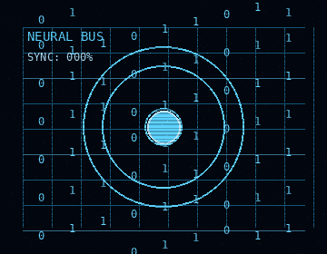
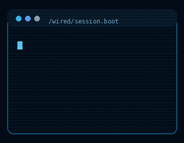
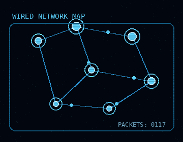

 

 
 

---

<table>
<tr>
<td width="58%" valign="top">

## 🫆 Sobre mí

Soy desarrollador Full Stack Junior con formación en **Big Data e Inteligencia Artificial**, **Desarrollo de Aplicaciones Web** y **Sistemas Microinformáticos y Redes**.

Me interesa especialmente el diseño web, crear soluciones útiles combinando herramientas y conocimientos, el análisis de datos e inteligencia artificial, desarrollo web tanto frontend como backend, y experimentar.

</td>
<td width="42%" align="center" valign="middle">

 

</td>
</tr>
</table>

---

## 🎭 Enfoque profesional

<table width="100%">
<tr>
<td width="35%" align="center" valign="middle">

 

</td>
<td width="65%" valign="top">

<table width="100%">
<tr>
<td width="50%" valign="top">

### 🌐 Desarrollo Web

`Frontend` `Backend` `APIs REST`  
`HTML / CSS` `JavaScript` `React`  
`PHP` `Java` `Node`  
`CRUD` `Git` `SQL` `MySQL`

</td>
<td width="50%" valign="top">

### 🔬 Big Data e IA

`Análisis de datos`  
`Machine Learning`  
`Python` `pandas` `NumPy`  
`scikit-learn` `Jupyter Notebook`  
`Power BI` `Streamlit`

</td>
</tr>

<tr>
<td width="50%" valign="top">

### ☁️ Cloud y DevOps

`AWS` `AWS Lambda`  
`AWS CloudFormation`  
`Microsoft Azure`  
`Kubernetes`  
`Automatización básica`  
`Despliegue de aplicaciones`

</td>
<td width="50%" valign="top">

### 🛠️ Sistemas y soporte

`Soporte técnico a usuarios`  
`Resolución de incidencias`  
`Diagnóstico de problemas técnicos`  
`Windows` `Linux`  
`TCP/IP` `Redes LAN`  
`Gestión de usuarios y permisos`

</td>
</tr>
</table>

</td>
</tr>
</table>

---

## 📖 Stack técnico

### Lenguajes y desarrollo web

### Bases de datos, datos e IA

 

### Herramientas y sistemas

---

## 📌 Proyectos destacados

<table>
<tr>
<td width="33%" valign="top">

### 🚗 Calculadora de emisiones de CO₂

Proyecto de Machine Learning aplicado a sostenibilidad.  
Modelo de regresión para estimar emisiones de CO₂ de vehículos usando datos técnicos.

**Tecnologías:**  
`Python` `pandas` `scikit-learn` `Streamlit` `joblib`

</td>
<td width="33%" valign="top">

### 🗄️ Aplicación web con base de datos

Aplicación web con operaciones CRUD, conexión a MySQL y despliegue preparado para contenedores.

**Tecnologías:**  
`Flask` `MySQL` `Docker` `HTML` `CSS` `Python`

</td>
<td width="33%" valign="top">

### 📊 Análisis de datos y modelos de IA

Prácticas y proyectos relacionados con limpieza, tratamiento, visualización de datos y modelos de clasificación/regresión.

**Tecnologías:**  
`Python` `pandas` `NumPy` `scikit-learn` `Jupyter` `Power BI`

</td>
</tr>
</table>

---

---

---

## 🖥️ Wired Lab

<table width="100%">
<tr>
<td width="33%" align="center" valign="top">

**Interface / Visual Layer**

</td>
<td width="33%" align="center" valign="top">

**Boot / Development Layer**

</td>
<td width="33%" align="center" valign="top">

**Network / Systems Layer**

</td>
</tr>
</table>

---

## 📡 Actividad

---

## 🚹 Contacto

 

---

 

